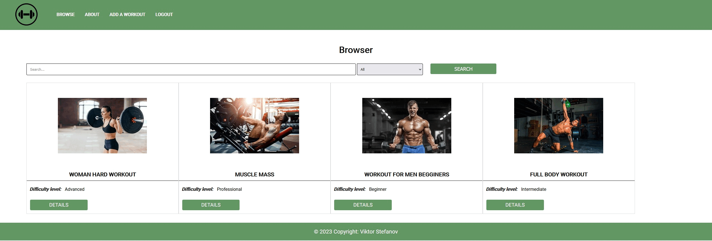

# Gym Academy

## Table of Contents

1. [Introduction](#1-introduction)
   - [Purpose](#11-purpose)
   - [Features](#12-features)
2. [User Authentication](#2-user-authentication)
   - [Login](#21-login)
   - [Registration](#22-registration)
3. [Workout Programs](#3-workout-programs)
   - [Browse Programs](#31-browse-programs)
   - [Add New Program](#32-add-new-program)
   - [Program Types](#33-program-types)
   - [Search Functionality](#34-search-functionality)
4. [User Roles](#4-user-roles)
   - [Visitor](#41-visitor)
   - [Authenticated User](#42-authenticated-user)
   - [Program Owner](#43-program-owner)
5. [Program Details](#5-program-details)
   - [View Program Details](#51-view-program-details)
   - [Edit Program](#52-edit-program)
   - [Delete Program](#53-delete-program)
6. [Conclusion](#6-conclusion)

## 1. Introduction

### 1.1 Purpose
GymAcademy is an application designed for fitness enthusiasts to discover, browse, and share workout programs. Whether you are a beginner, advanced, intermediate, or professional, GymAcademy provides a platform for users to access popular workout programs and contribute their own.

### 1.2 Features
- Browse popular workout programs
- Add new training plans
- Categorize programs based on difficulty levels (beginner, advanced, intermediate, professional)
- Search functionality
- User authentication (login/register)
- Program ownership (only owners can edit/delete their programs)
- Public access to view program details

## 2. User Authentication

### 2.1 Login
Users can log in to GymAcademy using their credentials, ensuring a personalized and secure experience.

### 2.2 Registration
New users can register for a GymAcademy account, providing them with the ability to contribute and personalize their experience within the application.

## 3. Workout Programs

### 3.1 Browse Programs
Users can explore a variety of workout programs categorized by difficulty levels (beginner, advanced, intermediate, professional).

### 3.2 Add New Program
Authenticated users have the privilege to add new training plans to GymAcademy, contributing to the community's collective knowledge.

### 3.3 Program Types
GymAcademy categorizes workout programs into four types based on difficulty levels:
- Beginner
- Advanced
- Intermediate
- Professional

### 3.4 Search Functionality
The application features a search option, allowing users to find specific workout programs quickly and efficiently.

## 4. User Roles

### 4.1 Visitor
Visitors can browse and view details about any program but cannot contribute or modify content.

### 4.2 Authenticated User
Authenticated users (those who have logged in) gain the ability to add new training programs and personalize their experience.

### 4.3 Program Owner
Owners of specific workout programs have exclusive rights to edit or delete their programs, ensuring control over the content they contribute.

## 5. Program Details

### 5.1 View Program Details
Users can view detailed information about any workout program, including exercises, duration, and other relevant details.

### 5.2 Edit Program
Program owners can edit the details of their programs, allowing them to update information as needed.

### 5.3 Delete Program
Program owners have the option to delete their programs if they wish to remove them from GymAcademy.

## 6. Conclusion

GymAcademy provides a comprehensive platform for all kinds of athletes to discover, contribute, and personalize their workout programs.

**Dependencies:** Express, Express-validator, Handlebars, MongoDB, Mongoose, Cookie-Partser, JsonWebToken, Bcrypt.
